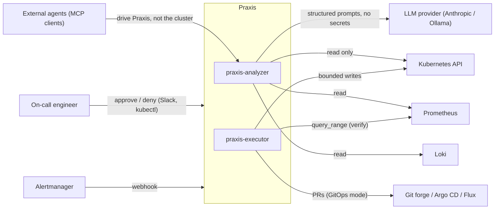
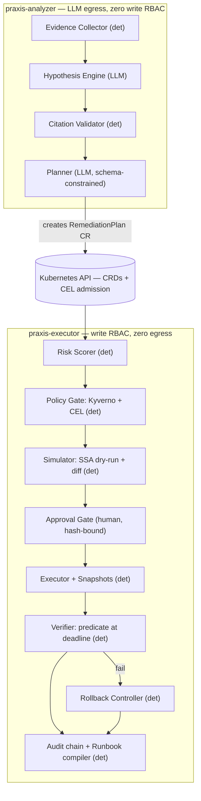

# Praxis — High-Level Design (HLD)

**Status:** Accepted for v1 · **Companion:** `00-MASTER-PLAN.md` (when), `02-LLD.md` (how, precisely)

---

## 1. Problem statement

LLMs diagnose Kubernetes incidents well and cannot be trusted to act on them. Five things are missing at once in the open-source landscape: a typed action surface, blast-radius accounting, pre-execution proof of safety, a pre-declared verification contract, and an automatic reversal path. Praxis supplies all five as one control loop. The design constraint that makes it credible: **the model that reasons has no credentials, and the process that acts has no model.**

## 2. Goals and non-goals

**Goals.** G1: every remediation is a reviewable, immutable, typed object. G2: policy-as-code is the final authority with no bypass path. G3: every executed change is verified against a pre-declared predicate and auto-reversed on failure. G4: the system's own benchmark measures fix rate *and harm rate*, reported as distributions. G5: autonomy is earned per action class from measured history, never assumed. G6: runs entirely on a laptop (kind), no cloud account.

**Non-goals.** Being a better diagnostician than HolmesGPT (integrate, don't compete). Multi-cluster fleets (v2). A web UI (kubectl + Slack + Grafana are the interfaces). Free-form action execution of any kind, ever.

## 3. System context (C4 level 1)

Praxis sits between everything that *observes* the cluster and everything that *changes* it. External AI agents integrate by driving Praxis's API — they inherit its guarantees instead of bypassing them.

## 4. Component architecture and the privilege split (C4 level 2)

Two processes with **opposing privileges**. Compromising the model-facing service yields no write path; compromising the executor yields no exfiltration path.

| | `praxis-analyzer` | `praxis-executor` |
|---|---|---|
| Cluster RBAC | read-only (no Secrets, ever) + create `RemediationPlan` | scoped writes per action class + status writes |
| Network egress | LLM provider only | **none** (NetworkPolicy-enforced) |
| Contains | Evidence Collector, Hypothesis Engine, Planner, LLM client | Risk Scorer, Policy Gate, Simulator, Approval Gate, Executor, Verifier, Rollback, Audit, Runbook engine |
| LLM code | yes (only place) | forbidden (import-boundary lint) |

Roughly 80% of the code path is deterministic. The LLM has exactly two jobs — rank hypotheses over a bounded evidence bundle (every claim must cite an evidence ID) and emit a schema-constrained plan — and it holds no credentials, runs no commands, and sees no secrets.

## 5. Incident lifecycle (data flow)

1. Trigger (Alertmanager webhook / failing probe / manual) creates an `Incident` with a declared **scope** — the boundary any remediation must stay inside.
2. Evidence Collector assembles a bounded, canonical, hashed `IncidentBundle` (objects, Events, owner chains, SLO burn, log *templates*, sync state). Hard caps, deterministic ordering, stable `ev/…` IDs.
3. Hypothesis Engine returns ranked hypotheses; the Citation Validator rejects any claim that doesn't resolve to a bundle ID — the structural hallucination guard.
4. Planner emits a `RemediationPlan` from the closed vocabulary, including the verification predicate and rollback strategy, bound to the bundle hash. Restraint ("no action") is a valid, scored outcome.
5. Risk Scorer computes blast radius deterministically; Policy Gate (Kyverno + CEL, from Git, versioned) and RBAC feasibility rule; Simulator dry-runs server-side and renders the diff. Rejection at any gate is a first-class outcome.
6. Approval Gate renders one card; approval is bound to a hash of (bundle, spec, diff, policy revision) — any drift voids it.
7. Executor snapshots, then applies via bounded API calls (direct mode) or a PR that Argo CD/Flux converges (GitOps mode).
8. Verifier evaluates the pre-declared predicate for the sustained window; failure at the deadline triggers automatic rollback, breaker trip, and loud escalation.
9. Audit appends a hash-chained record; after K verified successes, the Runbook Compiler promotes the plan so the next recurrence costs zero LLM calls.

## 6. Deployment view

Two Deployments (`analyzer`, `executor`) + CRDs (`Incident`, `RemediationPlan`, later `Runbook`, `AutonomyPolicy`, `PraxisConfig`) in namespace `praxis-system`. NetworkPolicies ship in the default manifests and are asserted by tests: executor→internet denied; analyzer egress allowlisted to the LLM endpoint. Leader election, work queues with backoff, finalizer `praxis.dev/executor` so an in-flight plan cannot be orphaned. Local dev: kind + Helm; the entire demo runs on a laptop.

## 7. The autonomy ladder

| Tier | Behaviour | Gate to enter |
|---|---|---|
| L0 Observe | evidence + hypotheses only | default for unfamiliar workloads |
| L1 Suggest | emits plans, never executes | day-one default |
| L2 Approve | policy + dry-run + human approval | most namespaces, indefinitely |
| L3 Auto+verify | executes under blast-radius budget, verifies, rolls back, notifies after | `AutonomyPolicy` grant **and** measured success history for that action class |
| L4 Runbook | compiled deterministic runbook, zero LLM | K verified successes of the same fingerprint |

L4 is *more* trusted than L3 while using *less* AI. That inversion is the design's center of gravity: the goal is to convert probabilistic reasoning into deterministic automation over time, not to maximize what the LLM does.

## 8. Security architecture (summary — full model in `docs/THREAT-MODEL.md`, Phase 7)

Trust boundaries: (B1) telemetry → analyzer: attacker-influenced data; wrapped as data, control sequences stripped, never instruction-positioned. (B2) analyzer → API server: only schema-valid plans can exist; closed vocabulary means injected text cannot invent a verb. (B3) plan → execution: policy final authority, scope check, dry-run, RBAC feasibility, hash-bound approval (kills TOCTOU / MCP rug-pull). (B4) executor → cluster: least-privilege per action class, no egress, snapshots before mutation, circuit breaker + global concurrency cap against runaway remediation. (B5) everything → audit: append-only hash chain recording model id, prompt hash, bundle hash, policy revision, approver, outcome. Secrets are excluded at the type level (no RBAC, no client method) — not filtered after the fact.

## 9. Technology stack (rationale in one line each)

Go + Kubebuilder/controller-runtime (the ecosystem's native toolchain); CEL ValidatingAdmissionPolicy-style rules in-schema (webhook-free, stable); Kyverno engine + CEL for the policy gate (graduated, YAML-native; OPA later if rules demand); Argo CD **and** Flux for GitOps mode (doubles audience, small cost); Prometheus + Loki + Tempo + OTel (evidence and verification substrate; GenAI semconv for LLM spans); Chaos Mesh for faults (CRD-driven, kind-friendly); Chainsaw for e2e (declarative K8s testing, from the Kyverno project); provider-agnostic LLM client, Anthropic first + Ollama for regulated/local; Helm + kind for packaging and dev; Sigstore/in-toto optional attestation ("proposed by model X from evidence hash Y under policy Z").

## 10. Key decisions (ADR index)

ADR-001 closed action vocabulary (security > flexibility, extension only via benchmark demand) · ADR-002 snapshotRef in status, spec immutable · ADR-003 integer confidencePercent (no floats in K8s APIs) · ADR-004 verification predicates from a template library (roadmap; free-form PromQL only in v1alpha1) · ADR-005 `RollingBack` phase added in Phase 5 · ADR-006 `RevertGitCommit` verb + GitOps-managed hard-refusal in Phase 6 · further ADRs as they land.

## 11. Top risks

R1 scope creep into "another AI SRE tool" — mitigation: the value is the execution contract; integrate HolmesGPT for hypotheses if tempted. R2 rollback correctness under partial failure — mitigation: honest `RollbackUnsafe` states over clever hacks; half of Phase 5 budgeted. R3 predicate gaming/weakness — mitigation: template library, LLM never evaluates its own predicate. R4 benchmark non-determinism — mitigation: distributions over N runs, stated openly. R5 fast-moving prior art — mitigation: publish v0.1 at week 10; being first to *name* the primitive matters.
